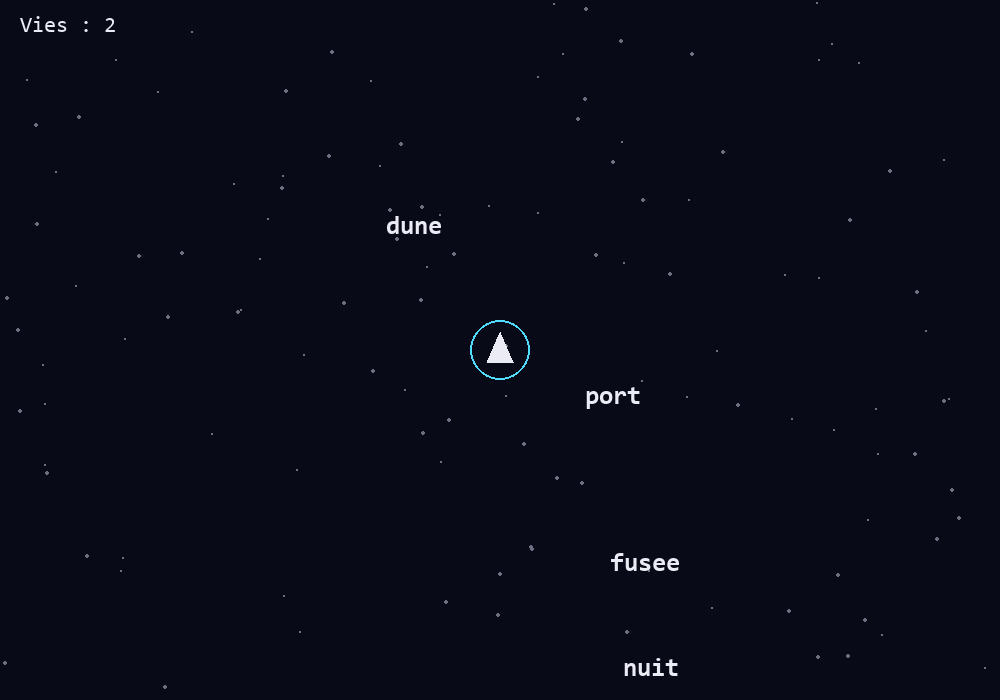

# Pygame – Typostéroïdes ⌨️☄️

Un jeu de **frappe au clavier** façon *Glyphica* / *ZType*, écrit en Python avec **Pygame**.
Votre vaisseau est **immobile au centre** de l'écran. Des **mots** arrivent de tous les côtés, de plus en
plus vite : il faut les **taper** pour les détruire avant qu'ils ne touchent votre bouclier.



---

## 🎯 Modalités d'évaluation

- 🗓️ **Date limite de rendu** : **à préciser en cours**
- 📦 **Format attendu** : un **dossier compressé (.zip)** nommé **Prenom.Nom.zip**
- 📧 **Envoi du projet** : le dossier `.zip` doit être envoyé **par mail** à l'adresse suivante :
  👉 **louis.mougenot@edu.univ-fcomte.fr**
- 📁 **Contenu obligatoire du dossier** :
  1. Un **seul fichier Python** contenant le jeu complet et **commenté**, nommé `prenomnom.py`
  2. Un dossier **`assets/`** contenant **toutes les ressources** utilisées (images, sons, `mots.txt`…), s'il y en a
  3. Un **fichier de documentation** (format libre : `.md`, `.pdf` ou `.txt`) détaillant :
     - Le **prompt** utilisé pour demander de l'aide à l'IA
     - Les **extraits de code** générés ou inspirés par l'IA
     - Une **explication claire** de **comment** ces éléments ont été **intégrés et adaptés** dans le code final

> ⚠️ Le dossier doit être complet et exécutable tel quel.
> L'absence d'un des éléments ou une structure différente entraînera une pénalité.

### 📂 Exemple de structure attendue

```bash
Prenom.Nom/
│
├── prenomnom.py            # Fichier Python du jeu, complet et commenté
│
├── assets/                 # Ressources du jeu (si vous en utilisez)
│   ├── mots.txt
│   └── explosion.wav
│
└── utilisation_IA.md       # Fichier expliquant l'usage de l'IA (prompt, code, intégration)
```

---

## 🗓️ Organisation du module (14 h)

| Séance | Durée | Contenu |
|---|---|---|
| **TD1** | 2 h | Boucle de jeu, vaisseau, mots qui foncent vers le joueur, collisions, vies |
| TD2 | 2 h | Menu, frappe au clavier, ciblage, lasers, score, difficulté progressive |
| TP1 | 4 h | Effets visuels et sonores, dictionnaire de mots externe |
| TP2 | 3 h | Ennemis spéciaux, bonus, boss |
| TP3 | 3 h | Sauvegarde des scores, pause, finition et rendu |

Les fichiers de chaque séance sont ajoutés à ce dépôt au fur et à mesure.

---

## 🚀 Installation et lancement

```bash
pip install pygame
python -m pygame.examples.aliens     # test : un petit jeu doit s'ouvrir
python TD1/td1_eleve.py              # lancer le TD1
```

> Si `pip` refuse : `python -m pip install --user pygame`

**Fichiers du TD1**

| Fichier | Rôle |
|---|---|
| `TD1/TD1_Typosteroides_enonce.pdf` | l'énoncé détaillé, avec les explications et les schémas |
| `TD1/td1_eleve.py` | le squelette à compléter : les trous sont marqués `# TODO n` |

> 💡 Le **numéro du TODO** est le **numéro de l'étape** de l'énoncé.

---

## 1) Rappels express sur Pygame

* Pygame est découpé en **modules** : `display` (fenêtre), `event` (clavier, souris), `draw` (formes),
  `font` (texte), `time` (horloge), `math` (vecteurs).
* Tout programme Pygame a la même forme :

```python
pygame.init()                                  # 1. démarrer
ecran = pygame.display.set_mode((800, 600))    # 2. ouvrir la fenêtre
while en_cours:                                # 3. LA BOUCLE DE JEU
    ...                                        #    événements, mise à jour, dessin
pygame.quit()                                  # 4. fermer proprement
```

---

## 2) Surfaces : ce que c'est *vraiment*

* Toute image est une **`Surface`** : la fenêtre (`ecran`), un texte rendu, une image chargée.
* L'écran n'est **pas** une scène d'objets : c'est une **grille de pixels**. Pour qu'un objet « bouge », on
  **efface tout** (`fill`), on **redessine tout** un peu plus loin, puis on **affiche** (`flip`),
  60 fois par seconde, comme un dessin animé.
* `blit` **colle** une Surface sur une autre : `ecran.blit(image, (x, y))`.

---

## 3) Repère et `Rect`

* ⚠️ L'origine `(0, 0)` est **en haut à gauche** et l'axe **`y` va vers le bas**.
  Le centre d'une fenêtre `1000 × 700` est `(500, 350)`. Pour **monter**, on **retire** à `y`.
* Un `Rect` sait se placer par ses points remarquables (`center`, `topleft`, `midbottom`…) :
  `rect = image.get_rect(center=(500, 350))` centre un texte sur un point.

---

## 4) Événements & entrées

* Pygame range tout ce qui se passe (touche, clic, croix de la fenêtre) dans une **file d'événements**.
  `pygame.event.get()` la vide **à chaque image** ; sinon la fenêtre « ne répond pas ».
* Au TD1 :
  * `pygame.QUIT` (la croix) et la touche **Échap** ferment le jeu ;
  * la touche **R** relance une partie après un game over.

---

## 5) Boucle de jeu & timing

```python
while self.en_cours:
    dt = self.horloge.tick(FPS) / 1000    # temps écoulé en SECONDES
    # 1) événements  2) mise à jour  3) dessin
```

* `tick(FPS)` limite le jeu à `FPS` images par seconde et renvoie le temps écoulé **en millisecondes**.
* Les vitesses sont en **pixels par seconde** et on les multiplie par **`dt`** : le jeu va à la même vitesse
  sur tous les ordinateurs.

---

## 6) Architecture du jeu

Le jeu tient dans **un seul fichier**, organisé en **classes** :

| Classe | Combien ? | Ce qu'elle sait (attributs) | Ce qu'elle fait (méthodes) |
|---|---|---|---|
| `Joueur` | 1 | `position`, `rayon`, `vies` | `est_vivant()`, `perdre_vie()`, `dessiner()` |
| `Mot` | plusieurs (une **liste**) | `texte`, `position`, `direction`, `vitesse` | `mettre_a_jour(dt)`, `touche(joueur)`, `dessiner()` |
| `Jeu` | 1 (le chef d'orchestre) | `ecran`, `horloge`, `joueur`, `mots` | `executer()`, `gerer_evenements()`, `mettre_a_jour(dt)`, `dessiner()` |

Les positions sont des **vecteurs** `pygame.Vector2` :

```python
p = pygame.Vector2(1040, 350)
c = pygame.Vector2(500, 350)
c - p                   # vecteur qui va de p vers c : Vector2(-540, 0)
(c - p).normalize()     # même direction, longueur 1 : Vector2(-1, 0)
p.distance_to(c)        # distance entre deux points : 540.0
```

---

## 7) Le TD1 pas à pas

On avance par **petites étapes** : *j'ajoute une chose → je lance → je vérifie → la suite*.

| Étape | Ce qu'on construit | TODO | Indice | En lançant, je dois voir… |
|---|---|---|---|---|
| 0–1 | Lire le squelette | – | constantes, classes, méthodes | la fenêtre s'ouvre et se ferme |
| 2 | La boucle de jeu | `2` | `while`, `tick(FPS) / 1000` | un ciel étoilé qui reste ouvert |
| 3 | Le décor | – | `NB_ETOILES` | plus ou moins d'étoiles |
| 4 | Le vaisseau | `4` | `draw.circle`, `draw.polygon`, **y vers le bas** | un triangle au centre, pointe en haut |
| 5 | Un mot immobile | – | `self.mots.append(Mot(...))` | « bonjour » dans le coin |
| 6 | Le mot bouge | `6a` `6b` `6c` | `(centre - position).normalize()`, `position += vitesse * dt` | le mot glisse vers le vaisseau |
| 7 | Naître de partout | `7` | `x = cx + a·cos(t)`, `y = cy + b·sin(t)` | les mots arrivent de tous les côtés |
| 8 | Un mot toutes les 2 s | `8a` `8b` | `random.choice`, un minuteur `+= dt` | un flot régulier de mots |
| 9 | Collisions | `9a` `9b` `9c` | `distance_to(...) < rayon`, liste `survivants` | les mots disparaissent au contact |
| 10 | Game over | `10a` `10b` | `self.vies` comparé à 0 | « GAME OVER » après 3 chocs, **R** relance |
| 11 | Afficher les vies | `11` | `police.render(...)`, `ecran.blit(...)` | « Vies : 3 » en haut à gauche |

> ⚠️ **Piège classique** : on ne supprime **jamais** un élément d'une liste pendant qu'on la parcourt.
> On construit une **nouvelle liste** avec les éléments à garder.

---

## 8) Check‑list débogage

* **La fenêtre s'ouvre et se ferme** ? La boucle de `executer` n'est pas écrite (TODO 2).
* **« Ne répond pas »** ? `self.gerer_evenements()` n'est pas appelé dans la boucle.
* **Tout va 1000 fois trop vite** ? Il manque le `/ 1000` après `tick(FPS)`.
* **Le triangle est à l'envers** ? Pour monter, c'est `y - 18`, pas `y + 18`.
* **Les mots ne bougent pas** ? Le TODO 6c (boucle sur `self.mots`) est oublié.
* **Les mots s'éloignent** ? C'est `centre - self.position`, pas l'inverse.
* **`IndentationError`** ? Les lignes sont mal alignées : 4 espaces par niveau, jamais de tabulation.
* **`NameError`** ? Une faute de frappe dans un nom (`self.positon`…).
* **Une erreur rouge** ? Lisez **la dernière ligne** du message en premier : elle dit ce qui ne va pas.

---

## 9) À la fin du TD1

Vous devez avoir un jeu où :

- ✅ un vaisseau est dessiné au centre de l'écran ;
- ✅ un mot apparaît toutes les 2 secondes sur un bord et fonce vers le vaisseau ;
- ✅ un mot qui touche le bouclier fait perdre une vie ;
- ✅ après 3 chocs, « GAME OVER » s'affiche et **R** relance une partie.

👉 **Gardez votre fichier** : au TD2, on rendra le jeu jouable (taper les mots pour les détruire).

Bon dev ! 🚀
